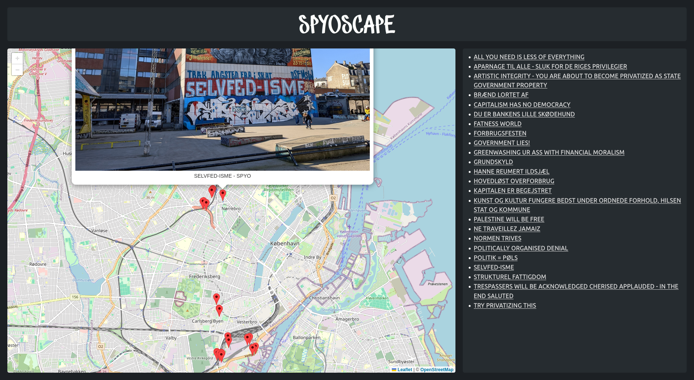

# SPYOSCAPE

**SPYOSCAPE ([spyoscape.dk](https://spyoscape.dk))** is a (work in progress) hobby project that aims to localise and map the artwork of the Danish graffiti artist **SPYO**. The artwork included on this site contains only political statements, phrases or alike. This means that regular tags and throwups etc. are not mapped.

**How do you know it actually is SPYO?**  
I don't. I make an educated guess based on context, painting style and letter formatting.

**Am I missing something?**  
You are very welcome to create a pull request with images of artwork I have not yet mapped. The process for doing so is described at the [contribution section](#contribution) section. Thank you for stopping by!

# Contribution
To add your submission to the project, follow the following procedure.

1. Add your image to static/images/. Please prioritise landscape oriented photos.
   - The naming of the image should be the quote in lower case with dashes instead of spaces. If the quote is long, it can be truncated with three dots. E.g. `very-long-quote-must....jpg`
   - Do you best to exclude the faces of bypassers when taking the photo.
3. Enter the data for the new image in `static/js/data.json`.
   - The list is alphabetically sorted, so find the suitable place.
   - **lat/lng**
     - You may use `generate-image-entry.py` to generate the boilerplate JSON and extract the `lat`/`lng` from the image (please verify them). The usage is `python generate-image-entry.py static/images/<image>.jpg` and the script requires the python [`exif`](https://pypi.org/project/exif/) package. If GPS information is not included in the exif data, you can enter the coordinates manually.
   - **name**
     - The `name` key should be the full and capitalised qoute of the actual artwork.
   - **authors**
     - The `author` key is a list of authors. It must at least contain **SPYO**.
   - **image**
      - The `image` key is a path to the image. Should be ./static/images/<your-image>.jpg
5. Run `make image` to resize the image to a width of 1920 pixels and remove the exif data from the image. `make image` requires the imagemagick and libimage-exiftool-perl (exiftool) packages.
6. Submit a pull request!
